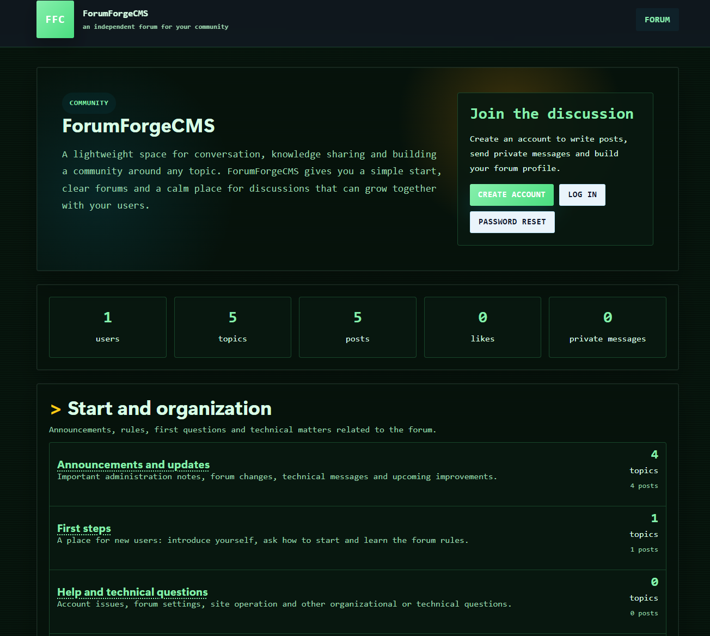
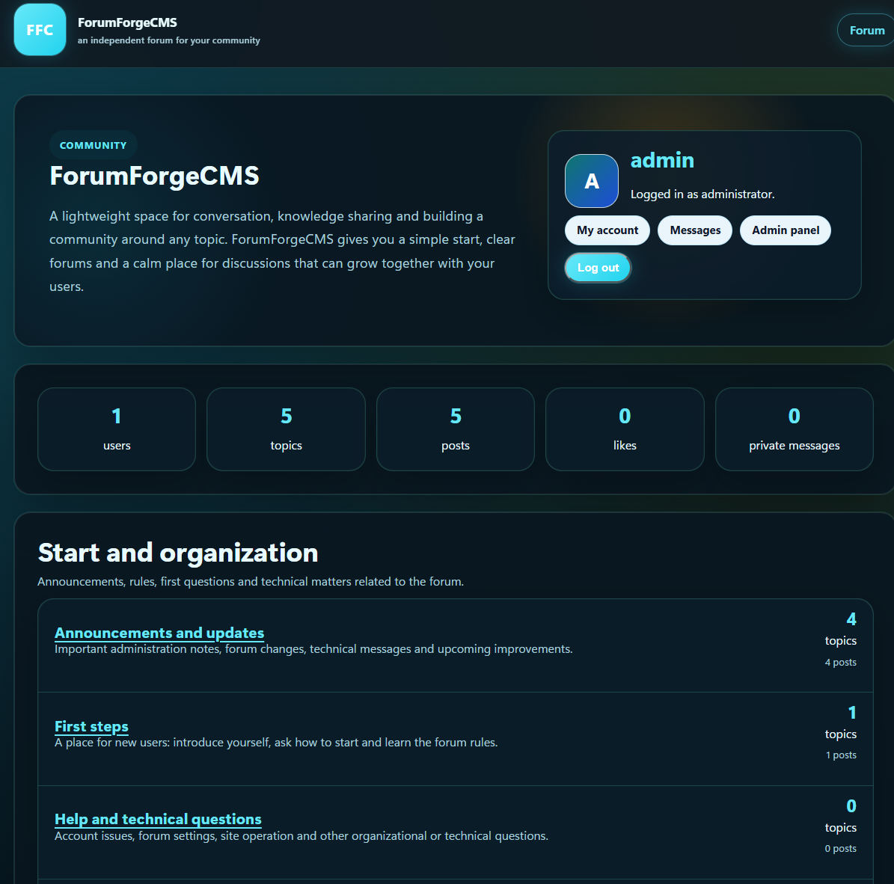
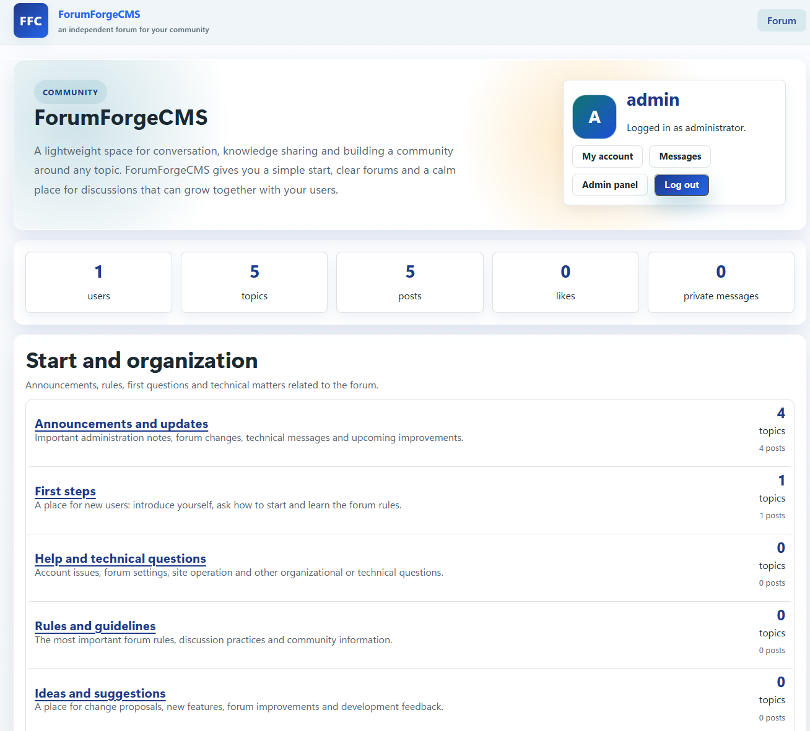
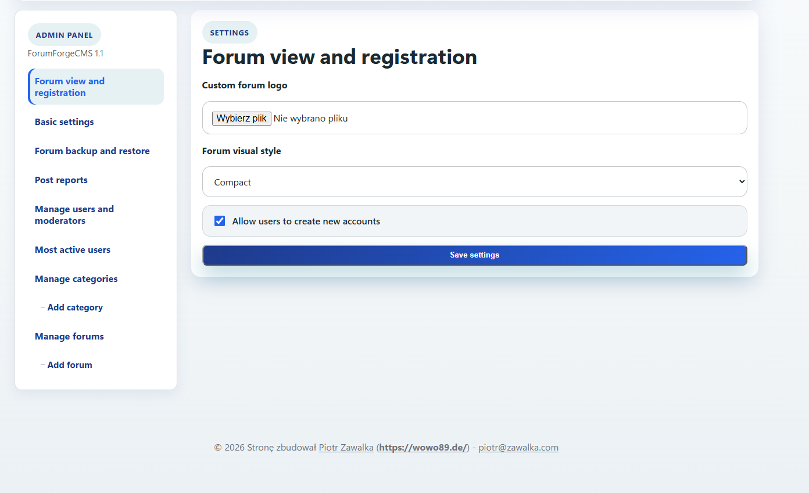
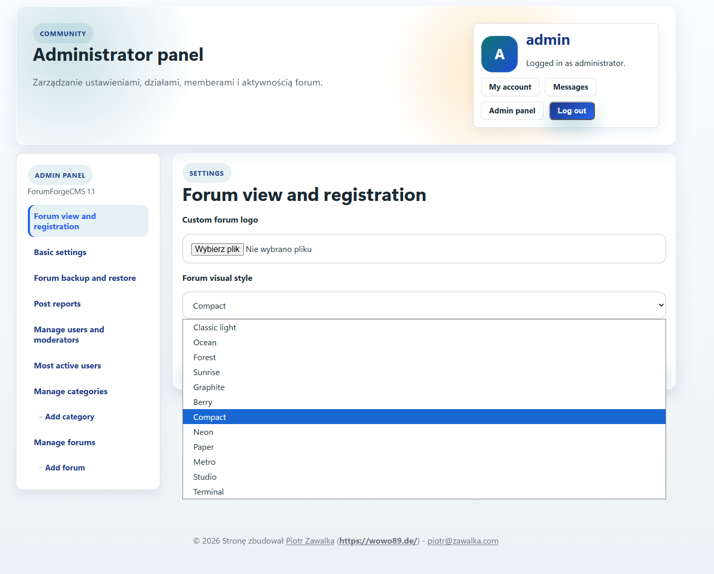
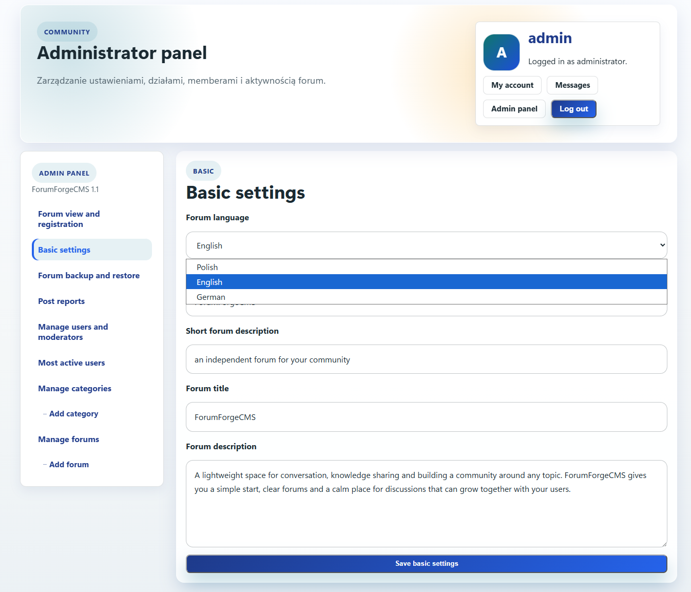
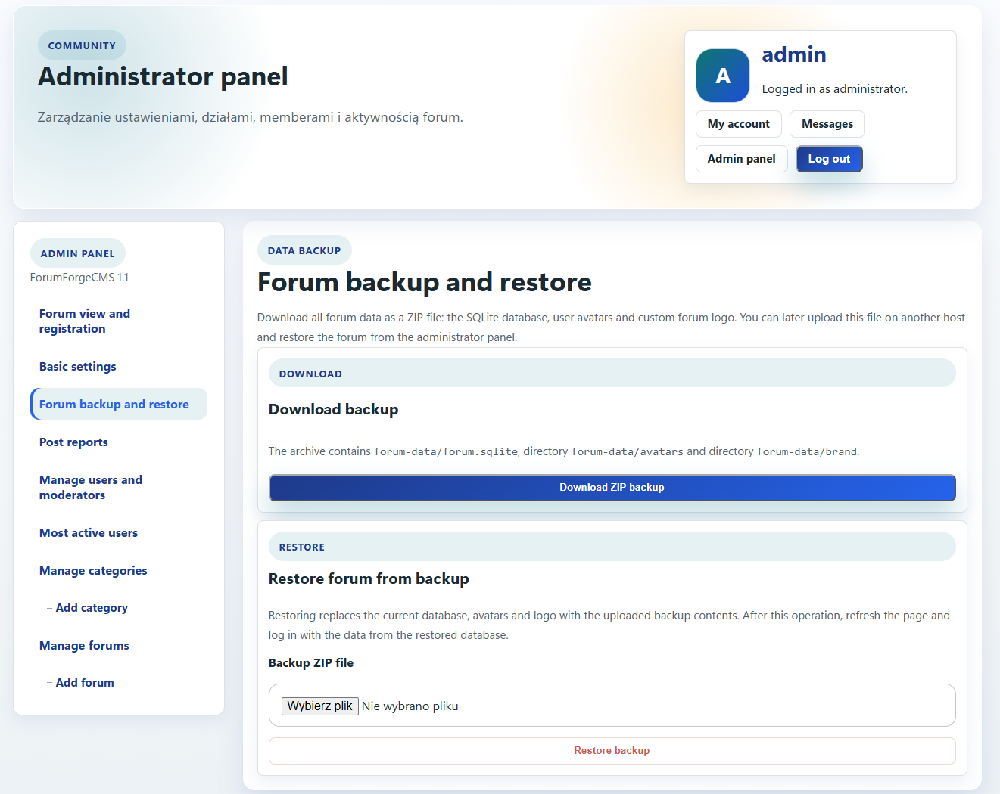

# ForumForgeCMS

ForumForgeCMS is a lightweight, self-hosted forum CMS built for classic PHP hosting environments. It is designed to run as a standalone website without a build pipeline, external services, or a dedicated database server. Upload the files, open the forum in a browser, and the system initializes itself with SQLite, a default administrator account, starter categories, and a clean administration panel.

The project focuses on practical deployment, readable moderation workflows, and a complete forum experience that can be hosted on standard web hosting packages such as Strato-style PHP hosting.

Current release: **ForumForgeCMS 1.2**

## Live Demo

Try ForumForgeCMS online:

[https://wowo89.de/forge](https://wowo89.de/forge)

## Key Features

- Standalone PHP forum CMS with SQLite storage
- Automatic first-run installation
- Default administrator account created as `admin`
- Generated initial administrator password stored in `forum-data/admin-initial-password.txt`
- Category and forum management from the admin panel
- User registration, login, password reset, avatars, profiles, and private messages
- Moderator role with post reports and moderation workflow
- Topics, replies, likes, pinned topics, locked topics, quotes, reports, and edit notes
- Rich post editor with formatting tools and an emoticon picker
- Built-in forum search for topics and posts with excerpts, forum names, result limits, and pagination
- Client-side image resizing and WebP conversion for avatars and forum logos
- Configurable forum name, description, logo, language, registration, and visual style
- Multiple visual themes with different layouts and presentation styles
- Multilingual interface support for English, Polish, and German
- Administrator backup and restore tools for the SQLite database, avatars, and custom forum logo
- Visible ForumForgeCMS version information in the administrator panel
- Basic SQLite performance settings and indexes for small to medium communities
- Protective files for `forum-data` on common Apache/IIS hosting setups

## Screenshots

### Forum Experience







### Administrator Panel









## Requirements

- PHP 8.1 or newer recommended
- PDO SQLite enabled
- Writable `forum-data/` directory
- Standard PHP sessions enabled
- Web server access to `index.php`

No Node.js, Composer, MySQL, PostgreSQL, Redis, or external mail library is required for the base forum.

## Installation

1. Upload all project files to your web hosting directory.
2. Make sure `forum-data/` is writable by PHP.
3. Open `index.php` in your browser.
4. The forum initializes automatically.
5. Log in with the default administrator username:

   ```text
   admin
   ```

6. Read the generated first password from:

   ```text
   forum-data/admin-initial-password.txt
   ```

7. After logging in, change the administrator password and complete the administrator profile.
8. Verify that these URLs are blocked by the hosting environment:

   ```text
   /forum-data/forum.sqlite
   /forum-data/admin-initial-password.txt
   ```

They should return `403 Forbidden` or otherwise be inaccessible from the browser.

## First-Run Language

On a clean installation, ForumForgeCMS detects the visitor browser language for English, Polish, and German. If the browser language is outside this supported set, English is used as the default. The administrator can later change the forum language from:

```text
Admin panel -> Basic settings -> Forum language
```

## Data Storage

ForumForgeCMS stores its runtime data in:

```text
forum-data/
```

This directory may contain the SQLite database, generated admin password, uploaded avatars, uploaded forum logo, and other runtime files. Runtime data is intentionally excluded from the repository and release source history.

## Backup And Restore

ForumForgeCMS includes an administrator panel section for downloading and restoring forum backups. The backup package contains:

```text
forum-data/forum.sqlite
forum-data/avatars/
forum-data/brand/
```

This is designed for classic shared hosting environments where moving a forum between hosts should be possible without database server exports. Download the ZIP backup from the administrator panel, upload the project files on the new host, log in as an administrator, and restore the backup from the same panel section.

## Search

ForumForgeCMS 1.2 adds built-in forum search. The first implementation uses SQLite `LIKE` queries for a simple, hosting-friendly search layer that works without extra database services or server extensions.

Search results include:

- matching topic titles
- matching post bodies
- the forum/category name
- author and date information
- a short content excerpt
- direct links to the matching topic or post
- pagination and result limits

The search system is intentionally lightweight for classic PHP hosting. SQLite FTS can be added in a future release if larger forums need more advanced indexing.

## Deployment Notes

ForumForgeCMS is intended for clean installations. Database migrations from older custom test builds are not part of the supported deployment workflow unless explicitly prepared for a specific release.

For typical small and medium communities, SQLite is sufficient when hosted on a reliable PHP hosting plan with correct file permissions and low-to-moderate concurrent write activity. For very large communities, high write concurrency, advanced search, or heavy analytics, a dedicated database backend would be a future architectural step.

## Security Notes

- Keep `forum-data/` protected from direct browser access.
- Change the generated administrator password immediately after the first login.
- Remove or protect `admin-initial-password.txt` after setup if your operational process allows it.
- Keep regular backups of `forum-data/`.
- Use HTTPS on production hosting.

## License

ForumForgeCMS is released under the ForumForgeCMS Private Use License 1.0.

You may use the software free of charge, including for public forums, but you may not modify it, remove author attribution, rebrand it, or redistribute modified versions without written permission from the author.

See [LICENSE](LICENSE) for the full terms.

## Author

ForumForgeCMS was created by [Piotr Zawalka](https://zawalka.com).

Additional contact:

- Website: [https://wowo89.de](https://wowo89.de)
- Email: [piotr@zawalka.com](mailto:piotr@zawalka.com)
